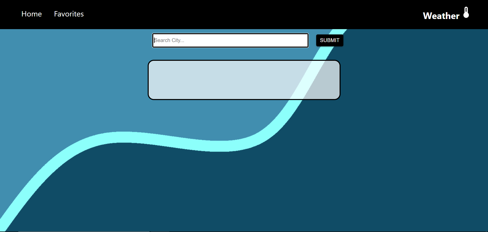
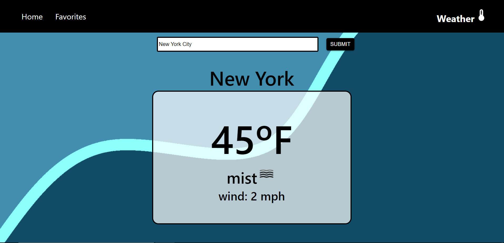
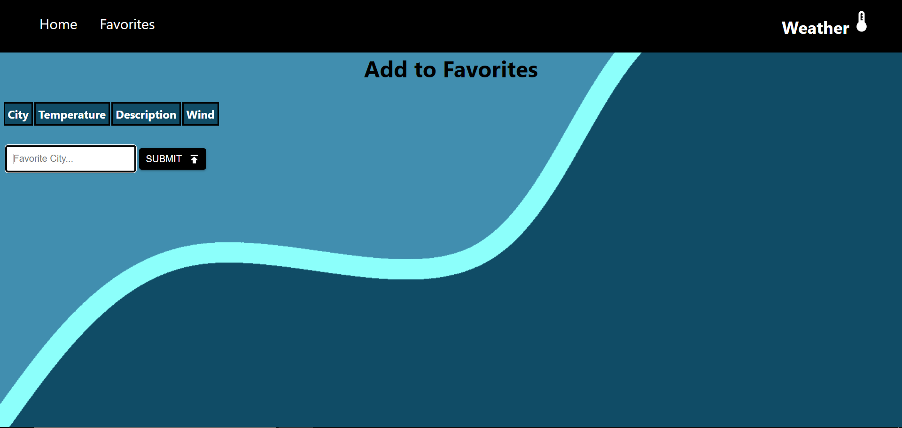
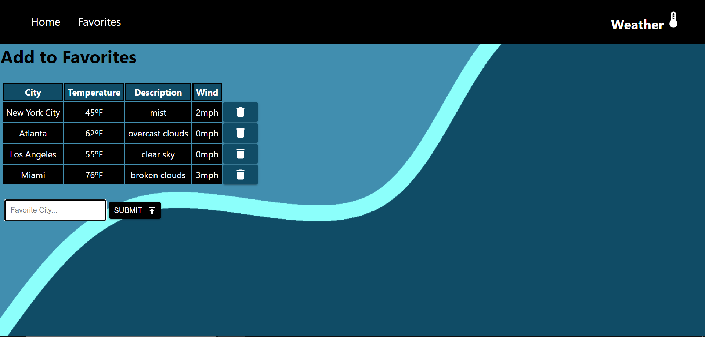

# Weather App Final Project

This project was bootstrapped with [Create React App](https://github.com/facebook/create-react-app).

## Application Screenshots

I have built a weather app that will display the temperature in fahrenheit, a small description of the weather and wind speed at that moment in time. Users will be able to search the weather for any City in the United States and once they submit their input, the weather will be displayed. Users can also navigate to the Favorites page, where they can save the weather for their favorite cities in a table.

